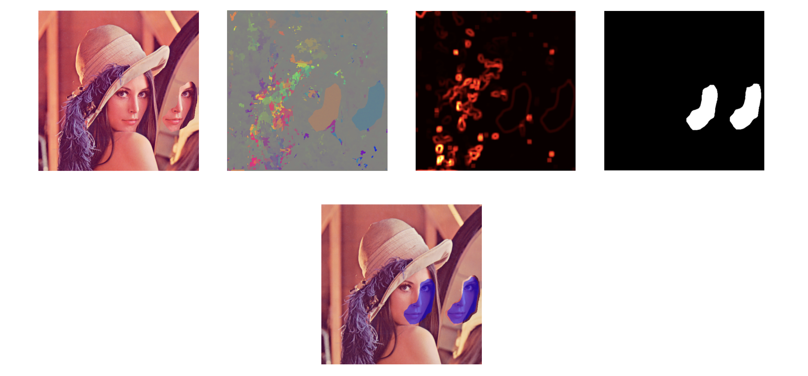

## Installation & Setup

### Prerequisites
Ensure you have **Python 3** installed.

### Clone the repository
Clone the project to your local machine:

```bash
git clone [https://github.com/y4sxk1n/IM01_PROJ.git](https://github.com/y4sxk1n/IM01_PROJ.git)
cd IM01_PROJ
```

### Installation
Install the required dependencies using the provided requirements file:

```bash
pip install -r requirements.txt
```

---

## Usage

To run the copy-move forgery detection, execute the `run_cf_detection.py` script.

### Syntax
```bash
python3 run_cf_detection.py <image> [iters]
```

### Arguments
* **`<image>`**: Path to the image file you want to analyze.
* **`[iters]`** *(Optional)*: Number of iterations for the PatchMatch algorithm.

### Examples

**Basic usage:**
```bash
python3 run_cf_detection.py images/test_01.jpg
```

**Specifying iterations:**
```bash
python3 run_cf_detection.py images/test_01.jpg 5
```
<br>
<br>

# Automatic Copy-Move Forgery Detection using PatchMatch

## Authors & Context

| Authors | Corlou Elias & Palagi Théo |
| :--- | :--- |
| Date | November 2025 |
| Project Goal | Implement and adapt the PatchMatch algorithm for detecting Copy-Move forgeries. |

---

## Project Overview

This project implements a robust method for detecting **Copy-Move** forgeries—a common image manipulation technique where a region is copied and pasted elsewhere in the same image.

We achieved this by repurposing the **PatchMatch** algorithm, originally designed for structural image editing, into a powerful forensic analysis tool. The core challenge was adapting the dense correspondence algorithm to distinguish between a *true forgery* and the *trivial self-match* that occurs when an image is compared to itself.

---

## Core Method: PatchMatch Adaptation

The foundational step is computing a **Nearest-Neighbor Field (NNF)** using PatchMatch, which exploits the property of local similarity to find the most similar patch for every pixel in the image.

### 1. The "Forbidden Zone" Constraint

The naive application of PatchMatch results in the trivial solution where every patch matches itself (offset of $f(x,y)=(0,0)$). To solve this, we introduced a spatial constraint: the **"Forbidden Zone"**.

* This zone is a circular area around the source pixel where any potential offset (displacement vector) is rejected.
* This forces the algorithm to search for a correspondence further away, effectively identifying the distant duplicated patch.

### 2. The Iterative Process

The algorithm iteratively refines the NNF through:
1. **Random Initialization:** Assigning random offsets.
2. **Propagation:** Spreading good matches by checking the offsets of neighboring pixels.
3. **Random Search:** Exploring new candidates in a concentrically-decaying search window to escape local minima.

---

## Automatic Detection Pipeline

To transform the raw (and often noisy) offset vector field into a clean, binary mask, we implemented a post-processing pipeline inspired by the work of T. Ehret.



| Step | Purpose | Rationale |
| :--- | :--- | :--- |
| **Median Filtering** | Clean the raw vector field noise. | Eliminates impulse noise while preserving the sharp boundaries of the falsified object. |
| **Error Map** | Measure the local coherence of the displacement. | In a copied area, the local variance of displacement vectors is near zero (vectors are coherent). In natural noise, the variance is high. |
| **Global Filtering** | Reduce false positives from repetitive textures. | Filters out displacements that are not part of a large, coherent group (e.g., >1000 pixels sharing the same vector). |
| **RMSE Check** | Verify visual quality of the match. | Eliminates false positives where the geometric displacement is coherent, but the color similarity (Root Mean Square Error) is too low. |
| **Binary Mask & Dilatation** | Final detection output. | Combines all thresholds via logical intersection and uses morphological operations to densify the detected zones. |

---

## Key Results and Robustness

Our method is highly effective for forgeries created by **simple translation**. Critically, the pipeline demonstrates strong robustness against common real-world image degradations:

* **Blurring:** The patch-based comparison allows the method to remain robust even on heavily blurred images.
* **Noise:** It is effective against added noise, including **Gaussian noise** and noise resulting from **JPEG compression**.

---

## Limitations & Future Work

1. **Geometric Invariance:** The current implementation is **rigid** and is not robust to **scaling** or **rotation** of the copied patch.
    * **Future Work:** This requires implementing rotation- and scale-invariant descriptors, such as **Zernike moments**, to represent patch content independent of its orientation.
2. **Uniform Zones:** Copy-Move detection within large, smooth areas (like skies or fields of grass) remains challenging due to high natural auto-similarity, which can lead to false positives or non-convergence.

---

## References

* [1] C. Barnes, E. Shechtman, A. Finkelstein, et D. B. Goldman. **PatchMatch: A Randomized Correspondence Algorithm for Structural Image Editing.** *ACM Transactions on Graphics (TOG)*, 28(3), 2009.
* [2] T. Ehret. **Automatic Detection of Internal Copy-Move Forgeries in Images.** *Image Processing On Line*, 9:47-77, 2018.
